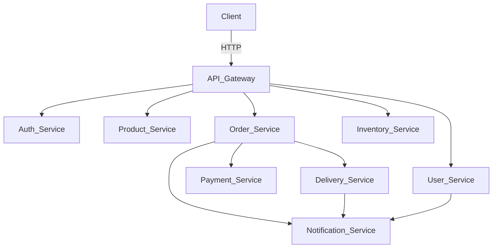

# E-commerce Microservices Platform

[](https://nestjs.com/)
[](https://www.typescriptlang.org/)
[](https://www.rabbitmq.com/)
[](https://www.postgresql.org/)

An e-commerce platform built with NestJS microservices architecture using RabbitMQ for inter-service communication.

## Features

- **Authentication & Authorization**
  - JWT-based authentication
  - OAuth2.0 (Google, GitHub)
  - Role-Based Access Control (RBAC)
  - Refresh token rotation
- **Product Management**
  - CRUD operations for products/categories
  - Product reviews and ratings
- **Order Processing**
  - Distributed transactions with Saga Pattern
  - Inventory reservation system
- **Payment Integration**
  - Payment processing flow
  - Refund management
- **Delivery Tracking**
  - Order status updates
  - Delivery lifecycle management
- **Notification System**
  - Email notifications
  - Event-driven architecture
- **API Gateway**
  - Single entry point for all services
  - Request routing and validation
  - Rate limiting with Redis

## Architecture



## Project Structure

```
  e-commerce-microservices/
  ├── apps/               # Microservices
  │   ├── api-gateway/    # API Gateway
  │   ├── auth/           # Authentication service
  │   ├── user/           # User management
  │   ├── product/        # Product catalog
  │   ├── inventory/      # Inventory management
  │   ├── order/          # Order processing
  │   ├── payment/        # Payment processing
  │   ├── delivery/       # Delivery tracking
  │   └── notification/   # Notifications
  ├── libs/               # Shared libraries
  │   ├── common/         # Common contracts and entities
  │   ├── logger/         # Logging utilities
  │   └── rmq/            # RabbitMQ utilities
  └── docker-compose.yml  # Docker Compose configuration
```

## Technologies

- **Core:** Node.js, NestJS,TypeScript
- **Database:** PostgreSQL with TypeORM
- **Messaging:** RabbitMQ
- **Caching:** Redis
- **Authentication:** JWT, Passport.js, OAuth2.0
- **API Documentation:** Swagger
- **Containerization:** Docker
- **Testing:** Jest

## Getting Started

### Prerequisites

- Docker & Docker Compose
- Node.js v18+
- RabbitMQ
- PostgreSQL

### Installation

1. Clone the repository:

```bash
  git clone https://github.com/gladyshewm/e-commerce-platform.git
  cd e-commerce-platform
```

2. Create `.env` files for each service using the provided examples
3. Start the services:

```bash
  docker-compose up --build
```

4. Access services:

- API Gateway: http://localhost:3000
- Swagger UI: http://localhost:3000/api
- RabbitMQ Management: http://localhost:15672

## Testing

Run unit tests for a specific service:

```bash
  cd apps/<service-name>
  npm run test
```

